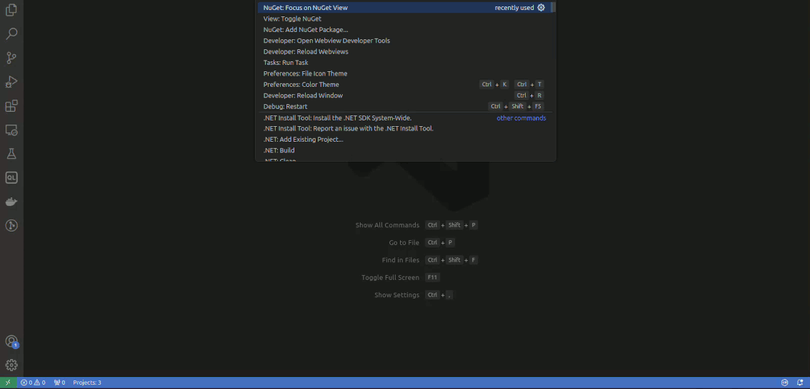
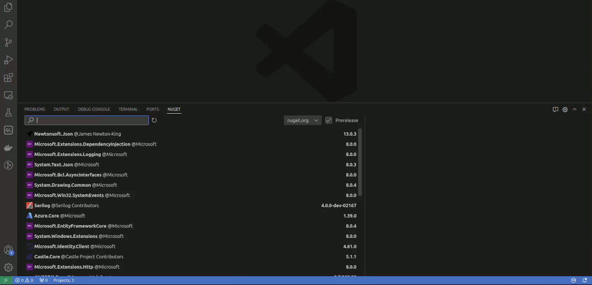

# NuGet Gallery Extension

Enhance your Visual Studio Code experience with the NuGet Gallery extension. Streamlining the process of managing NuGet packages, it makes installation, updating, and uninstallation efficient and user-friendly.

## Features

### Simplified Package Management

Effortlessly install, update, and uninstall NuGet packages for your projects directly within Visual Studio Code.

### Source Management

Manage your NuGet package sources effortlessly. Add, remove, or modify package sources to suit your project requirements.

> Utilize private feeds seamlessly with the required credential provider. Find installation instructions and more details [here](https://github.com/microsoft/artifacts-credprovider).

